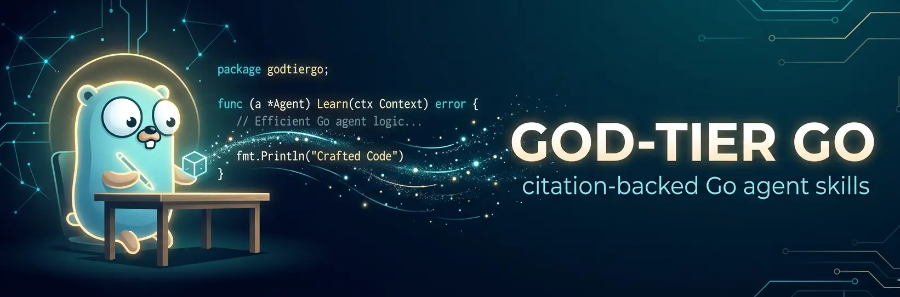
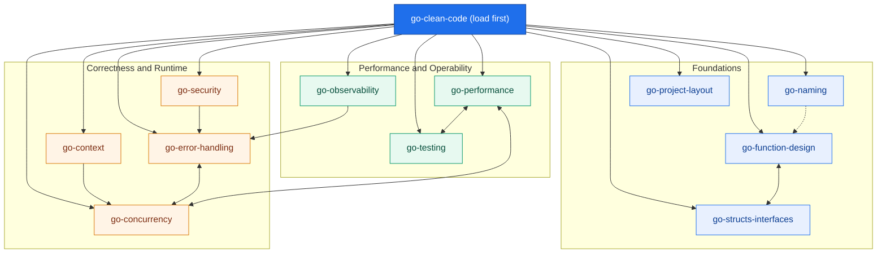

# God-Tier Go

<p align="center">
  <!-- Cover banner. Regenerate via docs/assets/cover-prompt.md if needed. -->
  
</p>

> Agent skills for writing **quality, high-performance, idiomatic Go** — every rule backed by a citation to real production code.

  

**God-Tier Go** is a set of 12 [Agent Skills](https://agentskills.io) that give an AI coding assistant (Claude Code, etc.) deep, opinionated expertise in writing Go the way the best teams write it.

What makes it different from generic "Go best practices": **every non-trivial claim points at the exact file and line where a world-class team does it** — the Go standard library, [chi](https://github.com/go-chi/chi), [Kubernetes](https://github.com/kubernetes/kubernetes), [Moby/Docker](https://github.com/moby/moby), [Prometheus](https://github.com/prometheus/prometheus), and [HashiCorp Vault](https://github.com/hashicorp/vault). No invented examples. No AI slop.

## The skills

**Foundations** — load `go-clean-code` first; it routes to the rest.

| Skill | What it covers |
|-------|----------------|
| [go-clean-code](skills/go-clean-code/SKILL.md) | Clarity over cleverness — early returns, naming, minimal state, doc comments. **Start here.** |
| [go-naming](skills/go-naming/SKILL.md) | Packages, interfaces (`-er`), `New`, `Err`, receivers, acronyms. |
| [go-function-design](skills/go-function-design/SKILL.md) | Function *shape* — small interface params, context-first/error-last, options, receivers. |
| [go-structs-interfaces](skills/go-structs-interfaces/SKILL.md) | *Type* design — tiny consumer-side interfaces, embedding, useful zero values. |
| [go-project-layout](skills/go-project-layout/SKILL.md) | `cmd/`, `internal/`, domain packages, module paths, no `utils/`. |

**Correctness & runtime**

| Skill | What it covers |
|-------|----------------|
| [go-error-handling](skills/go-error-handling/SKILL.md) | Wrap with `%w`, sentinel vs typed errors, `errors.Is/As`, never swallow, retries. |
| [go-context](skills/go-context/SKILL.md) | Cancellation, timeouts, `defer cancel()`, typed value keys. |
| [go-concurrency](skills/go-concurrency/SKILL.md) | Goroutine lifecycle, leak prevention, bounded `errgroup`, sync primitives. |
| [go-security](skills/go-security/SKILL.md) | `crypto/rand`, constant-time compare, TLS floor, input validation, injection. |

**Performance & operability**

| Skill | What it covers |
|-------|----------------|
| [go-performance](skills/go-performance/SKILL.md) | Benchmark first, `sync.Pool` reuse, preallocation, escape analysis, zero-copy. |
| [go-observability](skills/go-observability/SKILL.md) | Prometheus metrics + naming, structured `slog`, contextual logging, tracing. |
| [go-testing](skills/go-testing/SKILL.md) | Table-driven subtests, `t.Parallel`, benchmarks, fuzzing, golden files. |

## Skill map

These skills are **atomic, cross-referencing units**. Load `go-clean-code` first — it routes to every specialist; the specialists cross-link where their concerns touch. Installing a subset still works, but the full set gives a consistent view.



Solid arrows = `go-clean-code` routing; dashed/short arrows = the strongest specialist `→ See` cross-links. Full boundary map in [skills/README.md](skills/README.md).

## Install

> Repo: `https://github.com/Xyloforge/god-tier-go-skills`.

**Install with the [skills](https://skills.sh/) CLI** (universal, works with any [Agent Skills](https://agentskills.io)-compatible tool):

```bash
npx skills add https://github.com/Xyloforge/god-tier-go-skills --all
# or a single skill:
npx skills add https://github.com/Xyloforge/god-tier-go-skills --skill go-performance
```

<!-- prettier-ignore-start -->

<details>
<summary>Claude Code</summary>

These are plain Agent Skills (no plugin packaging), so install them by cloning into the discovery directory:

```bash
git clone https://github.com/Xyloforge/god-tier-go-skills.git /tmp/god-tier-go-skills
cp -R /tmp/god-tier-go-skills/skills/* ~/.claude/skills/
```

Or, from a local checkout, symlink each skill so it stays in sync with the repo:

```bash
cd god-tier-go-skills/skills
for s in go-clean-code go-naming go-function-design go-structs-interfaces \
         go-project-layout go-error-handling go-context go-concurrency \
         go-security go-performance go-observability go-testing; do
  ln -s "$PWD/$s" "$HOME/.claude/skills/$s"
done
```

Claude Code auto-discovers skills from `~/.claude/skills/` and `.claude/skills/`.

</details>

<details>
<summary>Openclaw</summary>

Copy skills into the cross-client discovery directory:

```bash
git clone https://github.com/Xyloforge/god-tier-go-skills.git ~/.openclaw/skills/god-tier-go-skills
# or in workspace:
git clone https://github.com/Xyloforge/god-tier-go-skills.git ~/.openclaw/workspace/skills/god-tier-go-skills
```

</details>

<details>
<summary>Gemini CLI</summary>

```bash
gemini extensions install https://github.com/Xyloforge/god-tier-go-skills
```

Update with `gemini extensions update god-tier-go-skills`.

</details>

<details>
<summary>Cursor</summary>

Copy skills into the cross-client discovery directory:

```bash
git clone https://github.com/Xyloforge/god-tier-go-skills.git ~/.cursor/skills/god-tier-go-skills
```

Cursor auto-discovers skills from `.agents/skills/` and `.cursor/skills/`.

</details>

<details>
<summary>Copilot</summary>

Copy skills into the cross-client discovery directory:

```bash
git clone https://github.com/Xyloforge/god-tier-go-skills.git ~/.copilot/skills/god-tier-go-skills
```

Copilot auto-discovers skills from `.copilot/skills/`.

</details>

<details>
<summary>OpenCode</summary>

Copy skills into the cross-client discovery directory:

```bash
git clone https://github.com/Xyloforge/god-tier-go-skills.git ~/.agents/skills/god-tier-go-skills
```

OpenCode auto-discovers skills from `.agents/skills/`, `.opencode/skills/`, and `.claude/skills/`.

</details>

<details>
<summary>Codex (OpenAI)</summary>

Clone into the cross-client discovery path:

```bash
git clone https://github.com/Xyloforge/god-tier-go-skills.git ~/.agents/skills/god-tier-go-skills
```

Codex auto-discovers skills from `~/.agents/skills/` and `.agents/skills/`. Update with `cd ~/.agents/skills/god-tier-go-skills && git pull`.

</details>

<details>
<summary>Antigravity</summary>

Clone into the cross-client discovery path:

```bash
git clone https://github.com/Xyloforge/god-tier-go-skills.git ~/.antigravity/skills/god-tier-go-skills
```

Update with `cd ~/.antigravity/skills/god-tier-go-skills && git pull`.

</details>

<!-- prettier-ignore-end -->

## How it works

Skills use **progressive disclosure** — a thin `SKILL.md` router (decision guide + core rules + checklist) with depth in `references/` (loaded on demand) and drop-in files in `assets/`:

```
skills/<skill>/
├── SKILL.md          # router: router-style frontmatter (triggers + → See pointers),
│                     # When to Activate, Decision Guide, Core Rules, Anti-Patterns,
│                     # Checklist, Deep Dives, Related
├── references/*.md   # cited deep dives
└── assets/*          # copyable files (secure-http-server.go, Makefile, alert rules, …)
```

Usage:
1. Load **go-clean-code** first — it routes you to the right specialist.
2. Follow the `→ See` pointers (in each skill's `description`) and **Related** section.
3. Run the **Checklist** before declaring code done.

The skills are intentionally non-overlapping — `go-clean-code` = the prose *inside* a function, `go-function-design` = the *signature shape*, `go-structs-interfaces` = the *type definitions*, `go-naming` = the *names*.

See [skills/README.md](skills/README.md) for the full catalog and boundary map.

## Provenance & verification

Every code snippet is cite-traceable. Citations reference the upstream projects above (their source is the corpus this set was distilled from). To re-verify against a local checkout of those repos, that every cited path exists:

```bash
grep -rohE '(chi-master|gostd|kubernetes|moby|prometheus-main|vault-main)/[A-Za-z0-9_./-]+\.go' skills \
  | sort -u | while read p; do [ -f "../$p" ] || echo "MISSING $p"; done
```

A clean run (no `MISSING`) means all 25 cited files resolve. Several upstream projects ship their own agent guides (`prometheus/AGENTS.md`, `moby/CLAUDE.md`) whose maintainer rules independently reinforce these skills.

## Repository layout

```
god-tier-go-skills/
├── README.md              # you are here
├── LICENSE
├── skills/                # the 12 skills (+ catalog README)
└── docs/                  # design spec and implementation plan
```

## Contributing

- Keep the **authority rule**: every non-trivial pattern needs a real, traceable citation. No invented examples.
- Respect skill **boundaries** (see the catalog). One concern per skill; cross-link with `→ See`.
- Keep `SKILL.md` a thin router; push depth into `references/`.

## License

MIT — see [LICENSE](LICENSE).
