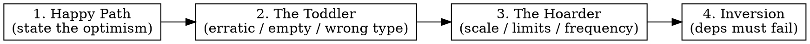

# Go Adversarial QA — Break the Function

Part of the **God-Tier Go** set. Every other skill helps you *write* good Go.
This one is the adversary: you assume the author was an optimist and you hunt the
inputs, scales, and dependency failures that the design quietly assumes will
never happen. Cognitive biases — optimism, anchoring on the happy path, the
illusion that callers are well-behaved — are where bugs live.

**Prime directive: you only identify *where* it will fail. You do not fix it.**
Naming the break is the deliverable. The fix is a separate job (and a separate
skill). Mixing "here's the bug" with "here's the patch" lets you talk yourself
out of reporting the scarier breaks.

## When to Activate

- Reviewing or hardening a function, HTTP/gRPC handler, parser, or decoder.
- Someone asks "what breaks this?", "where will this fail?", "is this robust?".
- A function is being signed off on the strength of its happy-path test only.
- You're about to trust an input, a size, or an external call you don't control.

## The Method — four passes, in order

Run them in sequence. Each pass is a different bias to exploit. Record every
break as **input/condition → observable failure → the assumption it violates**.
Do not propose remedies.



### 1. Define the Happy-Path assumptions

You cannot attack optimism you haven't named. Before touching inputs, write down
what the function *silently assumes is always true*: arguments are non-nil and
well-typed, slices/maps are populated, numbers are small and positive, the
network answers instantly, the clock moves forward, the caller invokes it once.
**Each assumption is a target.** The longer this list, the more fragile the code.

### 2. The Toddler — erratic, structurally wrong, or empty input

A toddler hands you the controller backwards and mashes every button. Feed the
function what a hostile or broken caller would, and watch for a `panic`, a wrong
result returned as if correct, or a silent zero.

Go's zero values are the toddler's favorite weapon — they compile and slip past
optimistic code:

```go
// The author "knows" cfg is non-nil and items is populated. The toddler doesn't.
func Summarize(cfg *Config, items []Item) string {
    return cfg.Prefix + strconv.Itoa(items[0].ID) // nil deref; index out of range
}

// Toddler payloads, each a distinct break:
Summarize(nil, items)        // panic: nil pointer dereference (cfg.Prefix)
Summarize(cfg, nil)          // panic: index out of range [0] with length 0
Summarize(cfg, []Item{})     // same: len 0, not nil — both must be probed
```

Toddler checklist for any Go signature:

- **nil**: pointer, slice, map (read ok / **write panics**), interface, func, channel.
- **empty vs nil**: `""`, `[]T{}` vs `nil`, `map[K]V{}` — they behave differently.
- **zero numbers & overflow**: `0`, negative where positive assumed, `MaxInt`/`MinInt`, `math.NaN()`, `+Inf`.
- **wrong-but-compiles**: garbage through `any`, `interface{}`, JSON, reflection, or a type assertion (`v.(T)` panics; `v, ok := v.(T)` doesn't).
- **malformed bytes/strings**: invalid UTF-8, embedded NUL, unterminated escape, truncated frame.

World-class code refuses to crash on toddler input. `netip.ParseAddr` takes any
string and an empty or garbage one returns a *typed error*, never a panic:

```go
// gostd/net/netip/netip.go:114 — the scan finds no '.'/':' and falls through to
// a clean error. ParseAddr("") and ParseAddr("☃") are errors, not panics.
return Addr{}, parseAddrError{in: s, msg: "unable to parse IP"}
```

If the function under review *would* panic on any toddler payload above, that's
your finding. (To pin it permanently, the toddler corpus is exactly a fuzz seed —
See [[go-testing]]. The defensive guard itself — See [[go-security]].)

### 3. The Hoarder — extreme scale, limits, and frequency

The hoarder never deletes anything and calls you a million times. Three axes:

- **Volume**: a 5 GB body, a 10-million-element slice, a 50-deep nested struct.
  Look for `make([]T, n)` / `make(map[..], n)` where `n` is attacker-controlled →
  instant OOM. Look for reading a whole response/file into memory unbounded.
- **Limits & overflow**: lengths that exceed `int` on 32-bit, `len*size`
  multiplications that wrap, a buffer/channel of fixed capacity that backs up,
  a recursion depth that blows the stack.
- **Frequency**: called in a tight loop or per-request — now an O(n²) inner scan,
  a per-call allocation, a leaked goroutine, or an unclosed file/conn is fatal.
  At frequency, "small leak" = "FD exhaustion / GC death." (Goroutine/FD lifecycle
  → See [[go-concurrency]]; per-call allocation in a hot path → See [[go-performance]].)

The break to report is the resource that grows without a ceiling. World-class code
puts a ceiling on anything it reads from an untrusted source — Moby caps an HTTP
response so a hostile server can't exhaust memory:

```go
// moby/daemon/logger/splunk/splunk.go:56,517 — the response is bounded, so a
// giant or malicious body reads at most maxResponseSize, never the whole stream.
maxResponseSize = 1024
// ...
rdr := io.LimitReader(resp.Body, maxResponseSize)
```

If the reviewed code reads, allocates, or recurses on an untrusted size with no
such ceiling, name the input that makes it fall over.

### 4. The Inversion Principle — what must fail outside the function

Invert the question. Don't ask "does the logic work?" — ask **"which external
dependency do I make fail to hang or crash this?"** Every call the function
*doesn't own* is a fault you can inject:

- **Network / RPC**: the peer accepts the connection and never replies → does the
  call block forever? A call with no deadline is a hang waiting to happen.
- **Database / storage**: query never returns; connection pool exhausted.
- **Clock**: time jumps backward (NTP), or a `time.Since` assumes monotonic
  forward motion; a `time.After` in a loop leaks timers.
- **Filesystem / OS**: disk full on write, partial read, EINTR, permission denied.
- **Channels / locks**: a receive with no `select { case <-ctx.Done(): }` blocks
  forever; a mutex held across one of the above I/O calls stalls every caller.

The single most common Inversion break in Go: **an external call with no
`context` deadline.** World-class code bounds it — Vault wraps a cloud-storage
call so a wedged network fails fast instead of hanging the node:

```go
// vault-main/physical/azure/azure.go:160 — the external GetProperties call can
// only block for 5s; a hung peer returns an error instead of freezing forever.
ctx, cancel := context.WithTimeout(context.Background(), 5*time.Second)
defer cancel()
_, err = containerURL.GetProperties(ctx, azblob.LeaseAccessConditions{})
```

For each dependency the function touches, state the failure mode it does NOT
survive. (Cancellation/deadline propagation → See [[go-context]]; retries and
not-swallowing the resulting error → See [[go-error-handling]].)

## Reporting the breaks

Output a flat list, most-severe first. One line per break:

```
[Toddler]   Summarize(cfg, nil)            → panic: index out of range — assumes items non-empty
[Hoarder]   DecodeFrame(r) with len=2^31   → make([]byte, n) OOM — assumes frame size is sane
[Inversion] fetchUser(id) when DB hangs    → blocks forever — no context deadline on the query
```

Severity order: **crash/hang (panic, deadlock, OOM) > silent wrong result >
resource leak > degraded performance.** A panic on empty input outranks a slow
path. Stop at the break — do not write the patch.

## Anti-Patterns (in the QA itself)

| Smell | Fix |
|-------|-----|
| Only reasoned about valid, populated, well-typed inputs | Run the Toddler pass — nil, empty, zero, garbage, overflow |
| "It works" after one happy-path trace | Happy path is the *assumption list*, not the verdict |
| Checked logic but trusted every external call | Run Inversion — make each dep hang/error/partial-fail |
| Found a break and immediately wrote the fix | Stop. Report the break. Fixing hides breaks you haven't found yet |
| Tested one large input, called it "scale-tested" | Hoarder is volume **and** overflow **and** frequency |
| Reported "could be more robust" (vague) | Report input/condition → exact failure → assumption violated |
| Assumed the caller invokes correctly/once | Frequency + erratic-caller are the whole point |

## Checklist

- [ ] Happy-path assumptions written down explicitly (the target list).
- [ ] Toddler: nil, empty-vs-nil, zero/negative/overflow numbers, wrong-type-via-`any`/JSON, malformed bytes — each probed.
- [ ] Every `make`/allocation/read/recursion on untrusted size checked for a ceiling (Hoarder volume).
- [ ] Length/size arithmetic checked for `int` overflow / wrap (Hoarder limits).
- [ ] Hot-path/per-call cost, leaked goroutines, unclosed handles considered (Hoarder frequency).
- [ ] Every external call (network, DB, clock, FS, channel, lock) has its hang/error/partial failure mode named (Inversion).
- [ ] Each break recorded as condition → observable failure → violated assumption.
- [ ] Breaks ranked crash/hang > wrong result > leak > slow.
- [ ] No fixes proposed — locating only.

## Related

- [[go-testing]] — turn each break into a table row or fuzz seed so it stays dead.
- [[go-context]] — the deadline/cancellation the Inversion pass keeps finding missing.
- [[go-concurrency]] — goroutine/channel leaks the Hoarder-frequency and Inversion passes expose.
- [[go-error-handling]] — once a break is real, return/wrap the error instead of panicking or swallowing.
- [[go-security]] — input validation and bounds are the defensive side of Toddler/Hoarder.
- [[go-performance]] — the hot-path allocation the Hoarder-frequency pass surfaces.
- [[explaining-code-logic]] — to *understand* gnarly logic before attacking it, trace it first with the interactive simulator.
```

